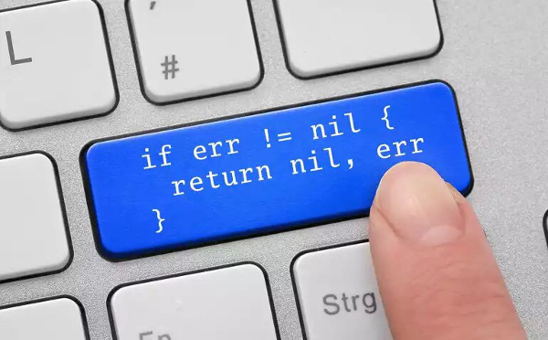

# Gestion des Erreurs en Go

Michel Casabianca

casa@sweetohm.net

---
## Slides Template Project

Considérons le source Go suivant :

```go
func printSum(a, b string) error {
	x, err := strconv.Atoi(a)
	if err != nil {
		return err
	}
	y, err := strconv.Atoi(b)
	if err != nil {
		return err
	}
	fmt.Println("result:", x + y)
	return nil
}
```

Sa gestion des erreurs est typique du Go : après chaque appel de fonction susceptible de renvoyer une erreur, on vérifie si elle s'est produite et on la renvoie à l'appelant, souvent accompagnée de valeurs nulles.

---
## Le problème

Le problème ici est que le code de gestion des erreurs est très verbeux et répétitif. C'est une corvée à laquelle aucun développeur Go ne peut se soustraire.



---
## Les solutions

Pour corriger ce problème, il a été proposé plusieurs solutions sous le forme de propositions d'évolution du langage :

- [Ajout de la fonction try](https://github.com/golang/proposal/blob/master/design/32437-try-builtin.md)
- [Ajout des mots clef check et handle](https://github.com/golang/proposal/blob/master/design/go2draft-error-handling.md)

Le premier a été rejeté cet été, donc je n'en parlerai pas.


---
## Les mots clefs *check* et *handle*

Notre source devient alors :

```go
func printSum(a, b string) error {
	handle err { return err }
	x := check strconv.Atoi(a)
	y := check strconv.Atoi(b)
	fmt.Println("result:", x + y)
	return nil
}
```

- *handle* déclare la manière de gérer le retour d’un appel de fonction renvoyant une erreur en dernière valeur de retour. Dans notre cas, on renvoie simplement l'erreur.
- *check* réalise un appel et si la dernière valeur de retour est une valeur non nulle, elle applique le gestionnaire déclaré avec handle.

Le source est strictement équivalent au précédent mais est bien plus concis et élégant.

---
## Handler par défaut

Si en plus on ajoute que toute fonction a un gestionnaire d’erreur par défaut qui renvoie des valeurs nulles et l’erreur renvoyée par l’appel, on obtient le code suivant pour notre fonction :

```go
func printSum(a, b string) error {
	x := check strconv.Atoi(a)
	y := check strconv.Atoi(b)
	fmt.Println("result:", x + y)
	return nil
}
```

Ce qui n’est pas mal du tout ! Vivement Go 2 :o)


